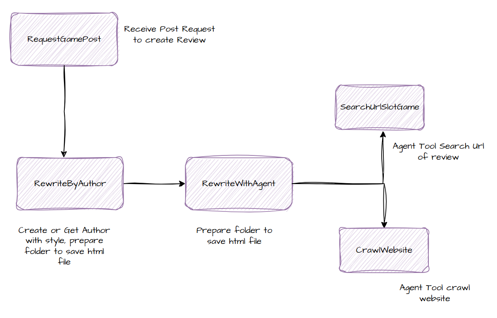
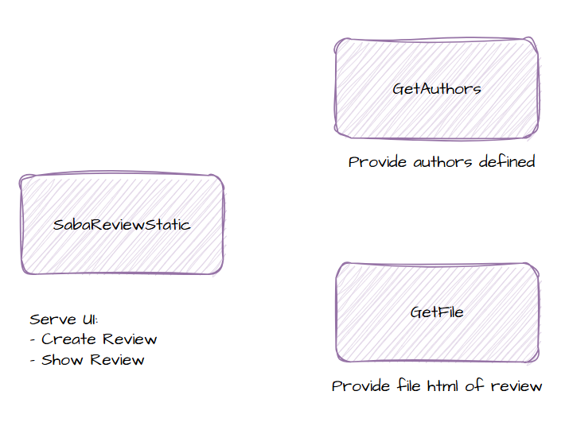

# 🛠️ How to Use Workflows in n8n

This guide walks you through setting up and using workflows in **n8n**, an open-source workflow automation tool.

---

## 📁 Preparation

### 1. Create a Folder for saving html file

The path is: `/tmp/saba-review2`

### 2. Create a Data Table

If your workflow involves storing or retrieving data, you may need a table.

#### Option A: Using n8n's Built-in Data (via `Data` node or `SQLite`)

- Add a **Database** node (e.g., SQLite or PostgreSQL).
- Use a `CREATE TABLE` SQL query in the node:

```sql
CREATE TABLE public.writer (
	id serial4 NOT NULL,
	"name" varchar NOT NULL,
	"style" varchar NOT NULL,
	folder varchar NULL,
	CONSTRAINT writer_pk PRIMARY KEY (id)
);
```

### 3. Self host crawl service (Crawl4AI)

Refer to [Crawl4AI documentation](https://docs.crawl4ai.com) for more information.

---

## ⚙️ Creating a Workflow

1. Open n8n and navigate to the **Workflows** section.
2. Click **➕ New Workflow** to create a new workflow.
3. To use a pre-built workflow from this folder (`saba-review/rewrite-with-game-name/`):
   - Click the **Import from File** button.
   - Select the desired workflow file (e.g., `.json`) from this folder.
   - The workflow will be loaded into the editor.
4. Review the workflow:
   - Check for any **Sub-Workflow** nodes and ensure the referenced sub-workflows are also imported.
   - Verify that all required **Credentials** (API keys, database connections, etc.) are set up in n8n.
5. Save and activate your workflow.

> **Tip:** You can find example workflow files and resources in the `saba-review/rewrite-with-game-name/` folder.

---

## ✅ Workflow description

### Main Flow



### UI Flow


